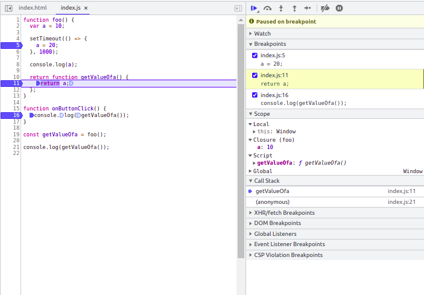
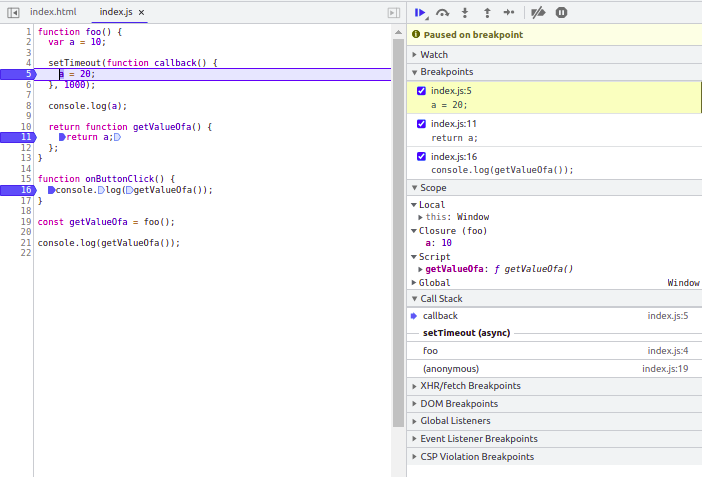
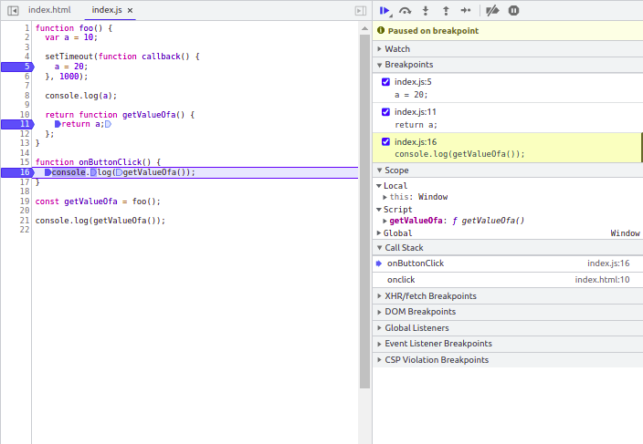

# Asynchronous Javascript

Asynchronous programming is a technique that lets your program begin a task that could take a while to complete while still being able to respond to other events without having to wait until that task is finished. When that task is complete, the result is delivered to you.

#### # Consider the example below, 

    setTimeout(()=>{
        console.log("Hi")
    }, 10000)

This is very common function used in javascript, the task of this function is to executes a function or specified piece of code once the timer expires.

Here we are not sure what time could be specified over here, it may be 10 or 10 thousand or may be 0. But, if the time is really long it will actually block the thread of execution for while. 

So the idea is to push these kinds of code to the bottom of the stack, and execute only once the execution of of all the synchronous code is done. 

#### How to push this code to the bottom of stack ?

Introducing **event loops**, the run time model of JS is based on event loops which is responsible for executing the code, collecting and processing events, and executing queued sub-task.
 

  
Source <a href="https://developer.mozilla.org/en-US/">MDN</a> - Runtime Model of JS - Event Loop

 

**Stack**: Stack can also be called the thread of execution, the every function  called is loaded in the stack for execution.

**Heap**:  The variable decarded as object points to memory address inside heap.

**Queue**:  A JavaScript runtime uses a message queue, which is a list of messages to be processed. Each message (async piece of code) has an associated function that gets called to handle the message. 

### # Working of Async Code

Whenever JS executer encounter as async piece of code, it is sent to event queue as message. Once the stack is empty the and the messages lined up in the executed. 

The oldest message is picked up first and loaded in the stack on the top of the function it was associated with. Each message is processed completely before any other message is processed.

#### # Example:

    function foo(){
		var a = 10
	    setTimeout(function callback(){
		    a = 20
	    }, 0)
	    console.log(a)
    }

Try running this function and think what will be the output, setTimeout callback is handled inside the queue as message, only once the value of a is logged in the last line. 
So the output is 10.

Wondering whether the callback changed the value of a or not ?

Refer the images below and try running the code, observe callstack and value of a.

Notice how the foo is loaded again after the completion, Also try attaching the **`onButtonClick`** function to button and observe the value of **`a`** being by the setTimeout's callback function.
