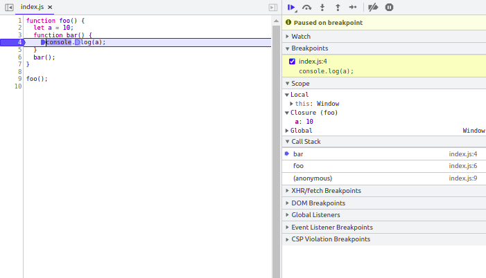
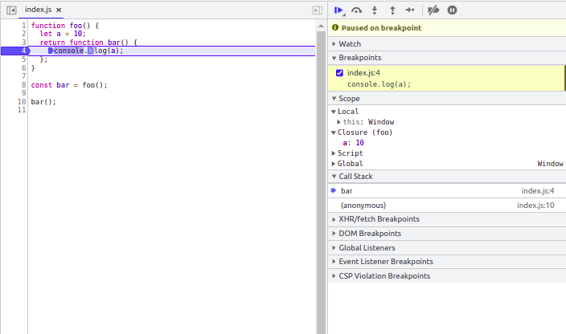

# Closures

Closures are nothing but just the,  reference to outer lexical environment outsides the outer execution context (parent's execution context), which is formed when functions bundled together (enclosed). 

### # Understand with an example 

    function foo() {
    	let a = 10
    	function bar() {
    		console.log(a)
        }
    	bar()
    }
    
    foo()

Here,  observe that the bar is using the variable **a**  defined in its outer scope. Also refer the image below where **bar** is running on the top of **foo**. But this is could be possible due to scope chaining i.e,  variable defined in one scope use from a different scope (from any scope function/local/global/ blocked).

This code outputs **10** in the console.  Refer the above image how it **bar** is executed on the top **foo**.

But what if,  we try to return **bar** from **foo** as shown below. 

    function foo() {
    	let a = 10
    	return function bar() {
    		console.log(a)
        }
    }
    
    const bar = foo()
    bar()

Now observe how **bar** is executed outside the context of **foo**. But instead throwing an error the closure i.e, reference to variable a in the outside of scope is preserved even outside the parent scope. Refer the image below -

This code outputs **10** in the console.

#### # Advantages of Closure

 - They let you to associate variables with an execution context.
 - Closure variables can assist in keeping a state that you can use later.
- They offer the encapsulation of data.
- They help in the maintenance of modular code.

#### # Disadvantages of Closure
  
 - A closure does not perform garbage collection on the variables defined.
 - Having too many closures can make your application slow. Duplication of code in the memory is the real source of this.
